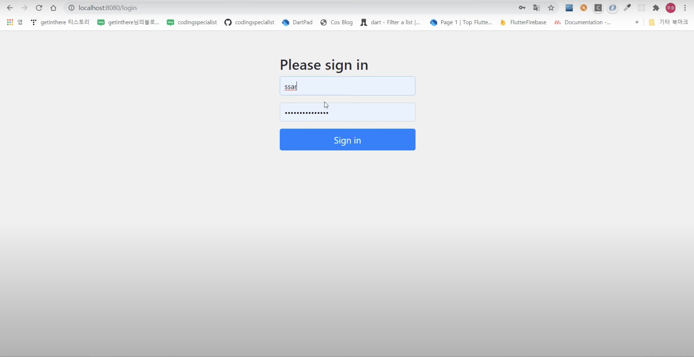

# 스프링 시큐리티 특강

## 1강 - 환경설정
**스프링 시큐리티 의존성**  
build.gradle에 아래와 같이 dependency를 설정한다.
```java
implementation 'org.springframework.boot:spring-boot-starter-security
```  

스프링 시큐리티 의존성을 설정하면 어느 페이지에 접속해도 로그인 폼이 나타난다.

  
## 2강 - 시큐리티 설정
**@EnableWebSecurity**
- 스프링 시큐리티를 활성화하고 웹 보안 설정을 구성하는 데 사용
- WebSecurityConfigurerAdapter 클래스를 상속하여 사용
- 스프링 시큐리티 필터 체인을 자동으로 생성하고 웹 보안을 활성화

**CSRF:Cross Site Request Forgery**
사이트 간 요청 위조(Cross-Stie Request Forgery, CSRF)는 웹사이트 취약점 공격의 하나로, 사용자가 자신의 의지와는 무관하게 공격자가 의도한 행위를 특정 웹사이트에 요청하게 하는 공격

formLogin.loginPage를 설정하면 인증이 필요한 페이지들은 모두 loginPage로 이동한다.

## 4강 - 시큐리티 로그인
loginProcessingUrl("/login"): login 주소가 호출이 되면 시큐리티가 낚아채서 대신 로그인을 진행해준다.

security session, SecurityContextHolder

Authentication 객체

Authentication 객체 내부에 User 정보가 존재

이때 User의 자료형은 UserDetail 유형의 객체

Security Session -> Authentication -> UserDetails

GrantedAutority getAuthorities : User의 권한을 반환

UserDetailsSerive : 시큐리티 설정에서 loginProcessingUrl를 통해 login 요청이 오면 자동으로 UserDetailsService 타입으로 IoC 되어 있는 loadUserByUsername 함수가 실행

## 5강 - 시큐리티 권한 처리
@EnableGlobalMethodSecurity : secured 어노테이션 활성, preAuthorize, postAuthorize를 활성화

@Secured : 하나만 걸고 싶을 때

@preAuthorize : 함수 시작 전, 여러 개 걸고 싶을 때

@postAuthorize : 함수 끝난 뒤

## 12강 - JWT를 이해하기 전 세션에 대해 알아보자
JWT = JSON WEB TOKEN 

쿠키

세션

세션ID가 사라지는 경우
1. 서버에서 세션ID를 삭제하는 경우
2. 사용자가 브라우저 종료
3. 특정 시간(30분)이 지나면 서버에서 세션ID가 사라지는 경우

세션의 단점
- 클라이언트가 많아서 로드밸런싱이 있을 때, request 보내지는 서버가 다르면 문제가 발생
    - 해결 방법: 처음 로그인한 서버에게만 계속 요청을 보내게 하는 방법, 각 서버마다 세션을 복제하는 방법, 세션 정보를 DB에 저장하는 방법, **세션 정보를 메모리 공유 서버(ex.Redis)에 저장하는 방법**

## 13강 - JWT를 이해하기 전 TCP에 대해서 알아보자
**OSI 7계층**
- 7계층: Application Layer
- 6계층: Presentation Layer
- 5계층: Session Layer
- 4계층: Transport Layer
- 3계층: Network Layer
- 2계층: DataLink Layer
- 1계층: Physical Layer

**TCP(Transmission Control Protocol)**
- 신뢰적이고 연결지향형 서비스를 제공
- 혼잡 제어: 혼잡한 네트워크 링크에서 각 TCP 연결이 링크의 대역폭을 공평하게 공유하여 통과하도록 제어
- 웹은 TCP를 사용

**UDP(User Datagram Protocol)**
- 비신뢰적이고 비연결형인 서비스를 제공

## 14강 - JWT를 이해하기 전 CIA에 대해서 알아보자
**CIA**
- **기밀성(Confidentiality)**  
    개인정보, 민감한 정보 등을 인가된 사용자에게만 허가해야 한다.
- **무결성(Integrity)**  
    내용의 변경이나 훼손 없이 정확하게 보존해야 한다.
- **가용성(Availability)**  
    항상 정상적으로 신뢰성 있는 서비스를 제공해야 한다.

**CIA를 지키는 방법**
- **문서 암호화(열쇠 전달 문제)**  
    암호화한 문서를 열 수 있는 열쇠를 어떻게 전달해야 하는지에 대한 문제
- **수신 응답(누가 보냈는가 문제)**  
    문서를 누가 보냈는지에 대한 문제


## 15강 - JWT를 이해하기 전 RSA에 대해서 알아보자
**RSA**
- 공개키 암호 알고리즘
- 암호화 뿐만 아니라 전자서명이 가능한 최초의 알고리즘
- RSA 알고리즘의 핵심의 큰 정수의 소인수 분해가 어렵다는 점을 이용하여 암호화
- 공개키 암호화 &rarr; 비밀키 복호화: 암호화
- 비밀키 암호화 &rarr; 공개키 복호화: 전자서명

**대칭키 기법**
- 비밀키 1개만 사용
- 암호화 및 복호화에 같은 키를 사용하는 암호화 알고리즘
- 키를 안전하게 교환하는 것이 가장 중요한 부분이며, 대칭키 탈취 시 암호화된 데이터를 쉽게 복호화 가능

**공개키 기법**
- 공개키와 비밀키 2개를 사용하여 암호화 및 복호화
    - 공개키(Public Key): 공개되어 있는 키
    - 비밀키(Private Key): 소유자만 아는 키

**RSA 알고리즘의 단계**
1. Key Generation
2. Key Distribution
3. Encryption
4. Decryption

**RSA 알고리즘의 구체적인 단계**
1. A는 문서를 B의 공개키로 암호화한다. &rarr; 암호화
2. A는 문서를 A의 개인키로 암호화한다. &rarr; 전자서명
3. A는 B에게 암호화된 문서를 전송한다.
4. B는 문서를 A의 공개키로 복호화한다. &rarr; 전자서명 확인
5. B는 문서를 B의 개인키로 복호화한다. &rarr; 복호화

## 참고자료
- [스프링 시큐리티에서 @EnableWebSecurity 어노테이션의 활용 방법과 기능](https://jjangadadcodingdiary.tistory.com/entry/%EC%8A%A4%ED%94%84%EB%A7%81-%EC%8B%9C%ED%81%90%EB%A6%AC%ED%8B%B0%EC%97%90%EC%84%9C-EnableWebSecurity-%EC%96%B4%EB%85%B8%ED%85%8C%EC%9D%B4%EC%85%98%EC%9D%98-%ED%99%9C%EC%9A%A9-%EB%B0%A9%EB%B2%95%EA%B3%BC-%EA%B8%B0%EB%8A%A5)
- 컴퓨터 네트워킹 하향식 접근 8판
- [[Spring Security] 03-1. Session, CIA, RSA](https://tscofet.oopy.io/2bac438f-93e7-41e1-af8c-f1130edc1779)
- [RSA, 제대로 이해하기](https://gngsn.tistory.com/96)
- [RSA 암호화 알고리즘이란?](https://ssdragon.tistory.com/87)