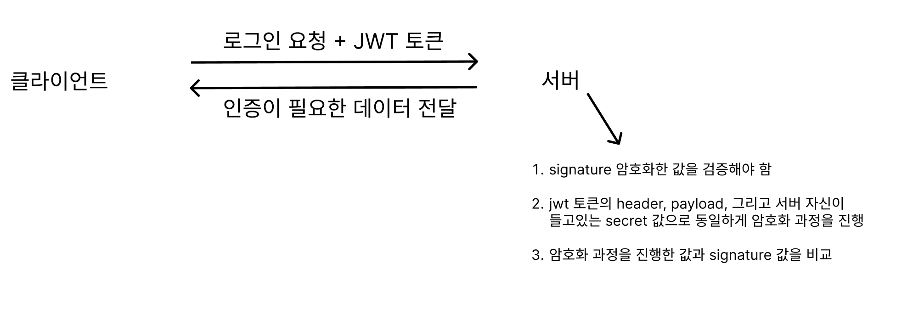

## JWT 구조 이해 : 17강

JWT ( Json Web Token ) 이란, 당사자간 정보를 JSON 객체로 전송하기 위한 방식입니다.

이전에 살펴보았던 디지털 서명, 암호화방식이 적용되어있고, JWT 는 디지털 서명, 즉 누가 이 데이터를 보냈는지에 대해 초점을 맞춘다고 볼 수 있습니다.

JWT 는 다음과 같이 구성됩니다.

- Header : 어떤 알고리즘을 사용했는지, 타입은 무엇인지 등
- Payload : 클레임을 가지고 있음
- Signature : Header, Payload, Secret Key 를 합쳐서 암호화한 값

JWT 는 다음과 같은 방식으로 동작합니다.

이후 클라이언트는 인증이 필요한 요청을 서버에게 보낼 때, JWT 토큰을 함께 보내게 됩니다.

서버는 이 JWT 토큰이 신뢰할 수 있는 토큰인지 검증하는 과정을 다음과 같은 방식으로 거치게 됩니다.

이 과정에서 header, payload, 그리고 secret 값은 서버에서 알고있는 데이터이기 때문에, 이를 암호화하여 signature 값과 동일한지 여부만 판단하면 됩니다.

## Bearer 인증 방식 : 21강

클라이언트가 서버에게 요청을 보낼 경우, Authorization Key 값에 JWT 값을 넣어서 보내는 방식을 Bearer 방식이라고 합니다.