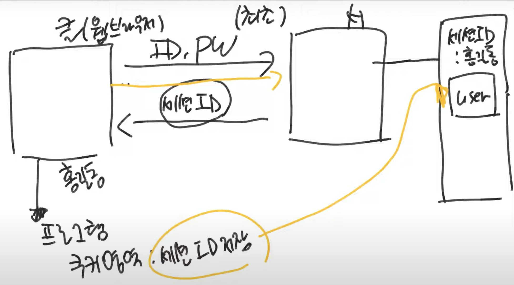

# 스프링 시큐리티 특강

## 17강 - JWT 구조 이해
**JWT(Json Web Toekn)**  
**JSON Web Token(JWT) is an open standard that defines a compact and self-contained way for securely transmitting information between parties as a JSON object.** This information can be verified and trusted because it is digitally signed. JWTs can be signed using a secret(with the HMAC algorithm) or a public/private key pair using RSA or ECDSA.

Although JWTs can be encrypted to also provide secrecy between parties, **we will focus on signed tokens.** <U>Signed tokens can verify the integrity of the claims contained within it,</U> while encrypted tokens hide those claims from other parties. When tokens are signed using public/private key pairs, the signature also certifies that only the party holding the private key is the one that signed it.

**HS256**  
SHA256 알고리즘은 데이터 무결성을 위해 사용되는 암호화 해쉬 알고리즘이다. SHA256 알고리즘은 SHA(Secure hash Algorithm) 알고리즘의 한 종류로서 256비트로 구성되면, 64자리 문자열을 반환한다.

HS256 알고리즘은 JWT 토큰의 암호화 알고리즘으로 많이 사용되는 암호화 알고리즘이다. HS256은 HMAC 알고리즘과 SHA256 알고리즘이 조합된 암호화 알고리즘이다. HMAC 알고리즘은 대칭키 암호화 알고리즘이다.


**RS256**
RS256은 RSA 알고리즘과 SHA256 알고리즘이 조합된 암호화 알고리즘이다. RSA 알고리즘은 비대칭키 암호화 알고리즘이다. RS256 알고리즘은 HS256 알고리즘과 달리, secret이 필요하지 않다.


**JSOn Web Token Structure**  
`xxxxx.yyyyy.zzzzz`
- **Header**  
    The header typically consists of two parts: the type of the token, which is JWT, and the signing algorithm being used, such as HMAC SHA256 or RSA.
    
    For example:
    ```json
    {
        "alg": "HS256",
        "typ": "JWT"
    }
    ```

    Then, this JSON is Base64Url encoded to form the first part of the JWT.

- **Playload**  
    The second part of the token is the payload, which contains the claims. Claims are statements about an entity (typically, the user) and additional data. There are three types of claims: registered, public, and private claims.

    For example:
    ```json
    {
        "sub": "1234567890",
        "name": "John Doe",
        "admin": true
    }
    ```

    The payload is then Base64Url encoded to form the second part of the JSON Web Token.

- **Signature**  
    To create the signature part you have to take the encoded header, the encoded payload, a secret, the algorithm specified in the header, and sign that.

    For example:
    ```
    HMACSHA256(
        base64UrlEncode(header) + "." +
        base64UrlEncode(payload),
        secret)
    ```

## 20강 - JWT를 위한 Security 설정
**SecurityConfig.java**
```java
@Configuration
@EnableWebSecurity
@RequiredArgsConstructor
public class SecurityConfig extends WebSecurityConfigurerAdapter {
    private final CorsFilter corsFilter;

    @Override
    protected void configure(HttpSecurity http) throws Exception {
        http.addFilterBefore(new MyFilter1(), BasicAuthenticationFilter.class);
        http.csrf().disable();
        http.sessionmanagement().sessionCreationPolicy(SessionCreationPolicy.STATELESS) // JWT를 사용하므로 session 사용 X
        .addFilter(corsFilter)
        .and()
        .formLogin().disable()  // form 로그인 방식 사용 X
        .httpBasic().diable()   // httpBasic 방식 사용 X
        .authorizeRequest()
        .antMatchers("/api/v1/user/**")
        .access("hasRole('ROLE_USER') or hasRole('ROLE_MANAGER') or hasRole('ROLE_ADMIN')")
        .antMatchers("/api/v1/manager/**")
        .access("hasRole('ROLE_MANAGER') or hasRole('ROLE_ADMIN')")
        .antMatchers("/api/v1/admin/**")
        .access("hasRole('ROLE_ADMIN')")
        .anyRequest().permitAll();
    }
}
```

**CorsConfig.java**
```java
@Configuration
public class CorsConfig {
    @Bean
    public CorsFilter corsFilter() {
        UrlBasedCorsConfigurationSource source = new UrlBasedCorsConfigurationSource;
        CorsConfiguration config = new CorsConfiguration();
        config.setAllowCredentials(true);   // 서버가 응답을 보낸 json 데이터를 javascript에서 처리할 수 있게 설정
        config.addAllowedOrigin("*");   // 모든 IP에 대해 응답을 허용
        config.addAllowedHeader("*");   // 모든 header에 대해 응답을 허용
        config.addAllowedMethod("*");   // 모든 HTTP 메서드에 대해 응답을 허용
        source.registerCorsConfiguration("/api/**", config);
    }
}
```

**Corss-Origin Resource Sharing(CORS)**


## 21강 - JWT Bearer 인증 방식
### 로그인
**Session 방식**


쿠키의 기본적인 정책은 동일 도메인에서만 요청이 올 때 발생한다.   
쿠키 방식을 사용하면 확장성이 떨어진다.  
header에 authorization에 ID, Password -> http의 Basic 방식  
ID, Password가 암호화가 되지 않는다.  
암호화를 시키려면 https를 사용해야 한다.  
우리가 사용하는 방식은 Authorization에 token을 넣는 방식이다.  
token 자체도 노출이 되면 안 되지만 그래도 iD, password가 노출되지 않는다.  
이러한 방식을 Bearer 방식이다.

## 22강 - JWT Filter 등록 테스트
### 방법1
**SecurityConfig.java**
```java
@Configuration
@EnableWebSecurity
@RequiredArgsConstructor
public class SecurityConfig extends WebSecurityConfigurerAdapter {
    private final CorsFilter corsFilter;

    @Override
    protected void configure(HttpSecurity http) throws Exception {
        http.addFilterBefore(new MyFilter1(), BasicAuthenticationFilter.class);
        ...
    }
}
```

**MyFilter1.java**
```java
public class MyFilter1 implements Filter {
    @Override
    public void doFilter(ServletRequest request, ServletResponse response, FilterChain chian) throws IOException, ServletException {
        chain.doFilter(request, response);
    }
}
```

### 방법2
**SecurityConfig.java**
```java
@Configuration
@EnableWebSecurity
@RequiredArgsConstructor
public class SecurityConfig extends WebSecurityConfigurerAdapter {
    private final CorsFilter corsFilter;

    @Override
    protected void configure(HttpSecurity http) throws Exception {
        ...
    }
}
```

**MyFilter1.java**
```java
public class MyFilter1 implements Filter {
    @Override
    public void doFilter(ServletRequest request, ServletResponse response, FilterChain chian) throws IOException, ServletException {
        chain.doFilter(request, response);
    }
}
```

**FilterConfig.java**
```java
@configuration
public class FilterConfig {
    @Bean
    public FilterRegisterationBean<MyFilter1> filter1() {
        FilterRegistrationBean<MyFilter1> bean = new FilterRegistrationBean<>(new MyFilter1());
        bean.addUrlPatterns("/*");
        bean.setorder(0);
        return bean;
    }
}
```
security filter가 제일 먼저 실행된다.

## 참고자료
- [JWT](https://jwt.io/introduction)
- [JWT 토큰 암호화 알고리즘 - HS256과 RS256](https://velog.io/@ddangle/JWT-%ED%86%A0%ED%81%B0-%EC%95%94%ED%98%B8%ED%99%94-%EC%95%8C%EA%B3%A0%EB%A6%AC%EC%A6%98-HS256%EA%B3%BC-RS256)
- [CORS(Cross-Origin-Resource Sharing)란?](https://velog.io/@hoo00nn/CORSCross-Origin-Resource-Sharing-%EB%9E%80)
- [악명 높은 CORS 개념 & 해결법 - 정리 끝판왕](https://inpa.tistory.com/entry/WEB-%F0%9F%93%9A-CORS-%F0%9F%92%AF-%EC%A0%95%EB%A6%AC-%ED%95%B4%EA%B2%B0-%EB%B0%A9%EB%B2%95-%F0%9F%91%8F)