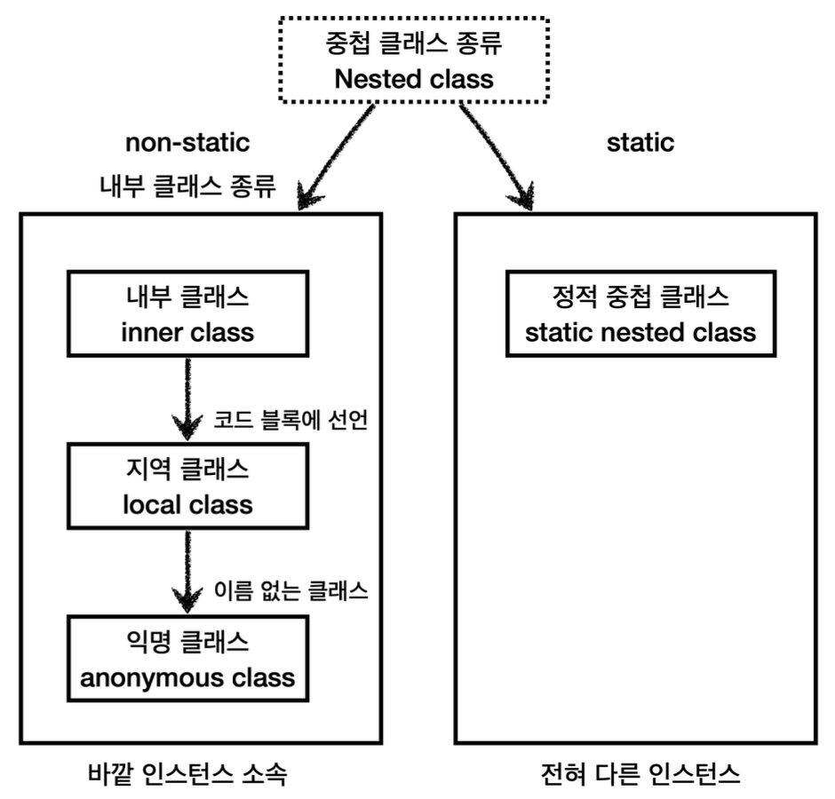
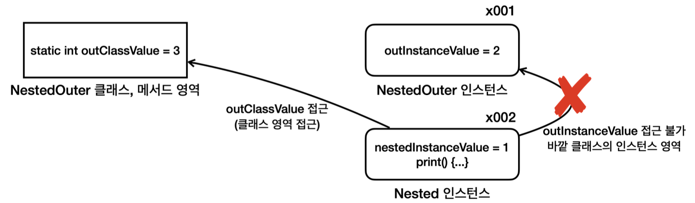

# 김영한의 실전 자바 - 중급 1편

## 섹션 7. 중첩 클래스, 내부 클래스1
### 중첩 클래스, 내부 클래스란?


**중첩 클래스의 분류**
- 정적 중첩 클래스
- 내부 클래스
    - 내부 클래스
    - 지역 클래스
    - 익명 클래스

**중첩 클래스의 선언 위치**
- 정적 중첩 클래스 &rarr; 정적 번수와 같은 위치
- 내부 클래스 &rarr; 인스턴스 변수와 같은 위치
- 지역 클래스 &rarr; 지역 변수와 같은 위치
- 익명 클래스는 지역 클래스의 특별한 버전
```java
class Outer {
    ...
    // 정적 중첩 클래스
    static class StaticNested {
        ...
    }

    // 내부 클래스
    class Inner {
        ...
    }

    public void process() {
        //지역 클래스
        class Local {...}

        Local local = new Local();
}
}
```

**중첩 vs. 내부**
- **중첩(Nested)**: 어떤 다른 것이 내부에 위치하거나 포함되는 구조적인 관계, 단순히 위치만 내부에 위치, 나의 내부에 있지만 나를 구성하는 요소는 아닌 것 &rarr; 바깥 클래스의 내부에 있지만 바깥 클래스와 관계가 없는 전혀 다른 클래스로, 바깥 클래스의 인스턴스에 소속되지 않는다.
- **내부(Inner)**: 나의 내부에 있는 나를 구성하는 요소 &rarr; 바깥 클래스의 내부에 있으면서 바깥 클래스를 구성하는 요소로, 바깥 클래스의 인스턴스에 소속된다.

**내부 클래스의 종류**
- **내부 클래스(inner class)**: 바깥 클래스의 인스턴스의 멤버에 접근
- **지역 클래스(local class)**: 내부 클래스의 특징 + 지역 변수에 접근
- **익명 클래스(anonymous class)**: 지역 클래스의 특징

**중첩 클래스를 사용해야 하는 경우**
중첩 클래스는 특정 클래스가 다른 하나의 클래스 안에서만 사용되거나, 둘이 아주 긴밀하게 연결되어 있는 특별한 경우에만 사용해야 한다.

**중첩 클래스를 사용하는 이유**
- **논리적 그룹화**: 특정 클래스가 다른 하나의 클래스 안에서만 사용되는 경우, 해당 클래스 안에 포함하는 것이 논리적으로 더 그룹화된다.
- **캡슐화**: 중첩 클래스는 바깥 클래스의 `private` 멤버에 접근할 수 있다. 이를 통해 `public` 메서드를 제거할 수 있다.

### 정적 중첩 클래스
```java
public class NestedOuter {
    private static int outClassValue = 3;
    private int outInstanceValue = 2;
     
    static class Nested {
        private int nestedInstanceValue = 1;

        public void print() {
            // 자신의 멤버 변수에 접근 가능
            System.out.println(nestedInstanceValue);

            // 바깥 클래스의 인스턴스 멤버 변수에는 접근 불가능
            //System.out.println(outInstanceValue);

            // 바깥 클래스의 static 멤버 변수에는 접근 가능. 해당 멤버 변수가 private이어도 접근 가능
            System.out.println(NestedOuter.outClassValue);
            // == System.out.println(outClassValue)
        }
    }
}
```

```java
public class NestedOuterMain {
    public static void main(String[] args) {
        NestedOuter outer = new NestedOuter();
        NestedOuter.Nested nested = new NestedOuter.Nested();
        nested.print();
   
        System.out.println("nestedClass = " + nested.getClass());
    }
}
```
- 정적 중첩 클래스는 `new 바깥클래스.중첩클래스()`로 생성할 수 있다.
- 중첩 클래스는 `바깥 클래스.중첩 클래스`로 접근할 수 있다.
- 바깥 클래스의 인스턴스와 중첩 클래스의 인스턴스는 서로 관련이 없는 인스턴스이므로 정적 중첩 클래스의 인스턴스만 따로 생성 가능하다.

실행 결과
```
1
3
nestedClass = class nested.nested.NestedOuter$Nested
```

