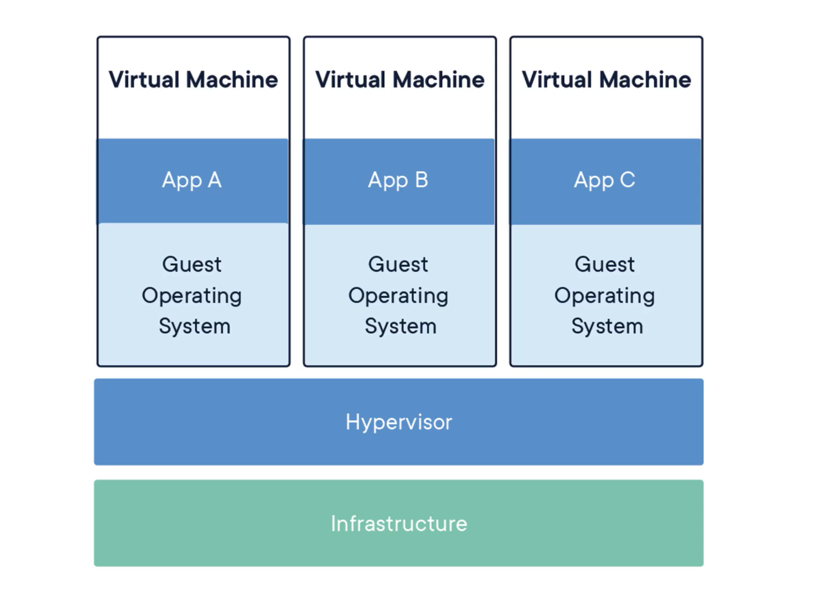
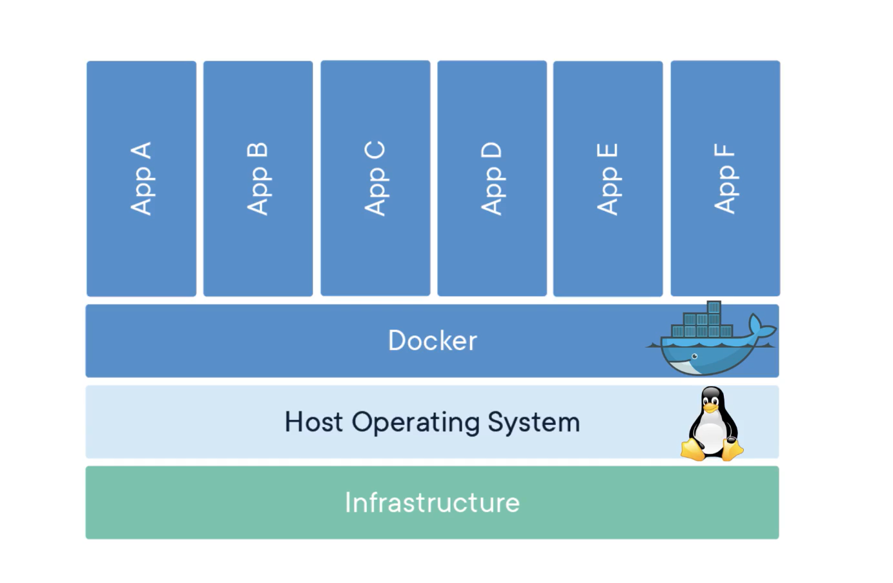
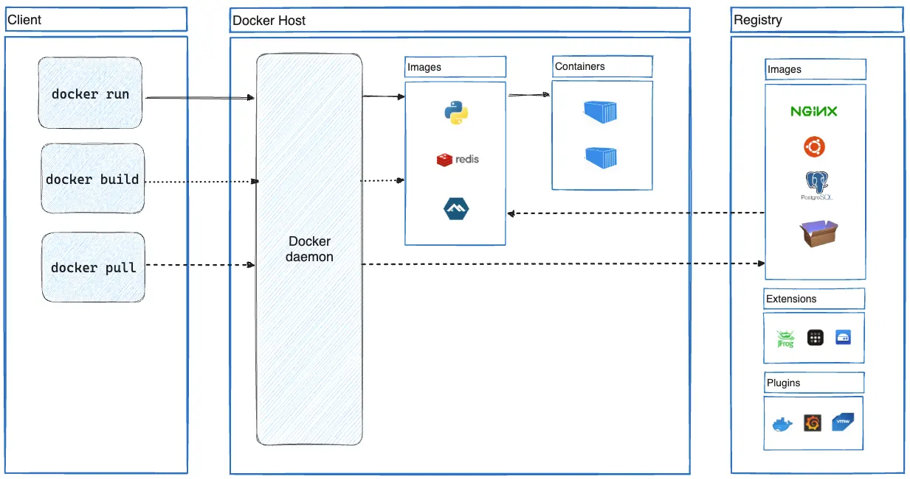
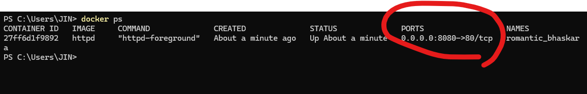

## Docker

Docker를 사용하는 이유
- 애플리케이션을 실행하는 과정을 간단하게 만들 수 있기 때문
- 예시) redis : docker run -it redis 하면 끝

Docker는 컨테이너라는 **격리된 환경**에서 애플리케이션을 패키징하고 실행하는 기능을 제공합니다.

Docker의 컨테이너에 대해 이해하기 위해선, 먼저 가상화 ( Virtualization ) 에 대해 이해할 필요가 있습니다.

### 가상화

현재 내 컴퓨터에서 A 라는 서비스를 제공하고 있다고 가정해봅시다.

만약 이 상황에서 B 라는 서비스를 새로 런칭하려고 한다면, A 서비스를 중지하고 B 서비스를 실행시켜야 합니다.

이 경우 컴퓨터를 한대 더 구매해서 A 서비스, B 서비스 따로따로 실행시키면 간단하게 해결될 문제입니다. 하지만 **비용 문제와 A 서비스를 실행중인 컴퓨터의 남은 리소스**를 활용하기 위한 방법을 고민하게 되었고, 여기서 등장한 개념이 바로 **가상화** 입니다.

Linux 를 사용하기 위해 VM Ware 를 써보셨다면 아시겠지만, 가상화는 내 컴퓨터의 리소스를 쪼개서 사용하는 기술을 말합니다.

( VM Ware 의 경우에도 내 하드디스크와 RAM 과 같은 리소스를 쪼개서 가상의 컴퓨터를 만들어주는 역할을 합니다. )

가상화를 도와주기 위한 소프트웨어가 필요한데, 그것이 바로 Hypervisor 입니다.

Hypervisor는 가상화 계층을 구현해주는 소프트웨어로, 하드웨어 ( Infrastructure ) 위에 가상 머신을 생성하고, 필요한 만큼 자원을 할당해주는 등 **가상화를 도와주는 매니저 역할**을 맡습니다. ( 그래서 Virtual Machine Manager 혹은 Monitor 라고 불리기도 함 )

그러면 가상화를 통해 새로운 컴퓨터를 만들었으니, 이제 서로 독립된 환경에서 A 서비스와 B 서비스 모두 하나의 컴퓨터로 돌릴 수 있게 되었습니다.

하지만 하나의 컴퓨터에서 여러개의 독립된 운영체제를 돌리다보니 리소스 낭비가 발생하게 됩니다.

그렇게 독립된 운영체제를 여러 개 띄울 필요 없이, 하나의 운영체제만으로 **독립된 환경**을 구성하는 Docker라는 기술이 탄생하게 되었습니다.

## Docker Architecture

Docker는 Client-Server Architecture를 사용합니다. 

우리는 명령어를 통해 Docker Daemon 과 통신합니다.

Registry 는 기본적으로 Docker Hub 를 나타냅니다.

예시로, 우리가 docker pull (image) 라는 명령어를 Docker Daemon에게 보내게 되면, Docker Daemon은 Registry ( 기본적으로 Docker Hub ) 에서 이미지를 찾습니다.

우리는 필요한 애플리케이션들을 이미지의 형태로 가지고 있으며, 이를 실행한 상태를 컨테이너라고 합니다.

## 6강 - 도커 컨테이너 실행하기

만약 도커를 활용해 서버를 실행할 경우, 포트포워딩을 해줘야만 접속할 수 있습니다.

왜 포트포워딩없이는 접속할 수 없는걸까요?

바로 도커에서 실행되는 모든 컨테이너는 격리된 환경에서 실행되기 때문입니다.

즉 각 컨테이너마다 자체적인 네트워크 공간을 가지고 있기 때문에, 도커 컨테이너 내부에서 실행되는 서비스를 Host OS ( 로컬 ) 에서 접근하려면 포트포워딩을 해줘야합니다.

